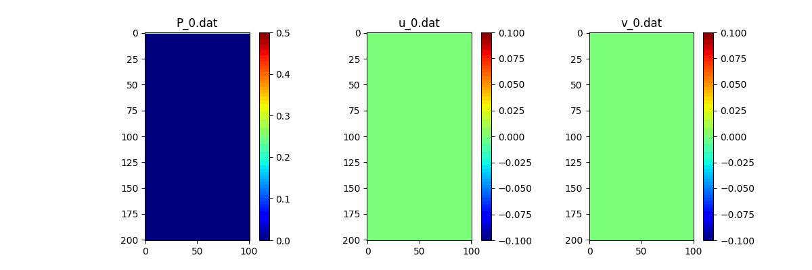

# Shared Memory Programming with MPI
## Repository README

This repository contains two Python scripts: `ani_gen.py` and `postprocess.py`. These scripts are designed to perform specific tasks related to generating animations and post-processing them, respectively.

### 1. ani_gen.py

`ani_gen.py` is Python script for generating animations from the simulation output. 

### 2. postprocess.py

`postprocess.py` merges the multiple output .dat files into a single file and then removing the original files. 

### 3. Serial_Navier-Stokes.cpp

`Serial_Navier-Stokes.cpp` MPI based Implementation. 

### Demo:
    
    Command: `mpiexec -n 4 .\mpi-assessment.exe`

    Output:
    559: 0.500029 Jacobi iterations: 21 vel_max: 0.00744536
    1512: 1.00013 Jacobi iterations: 8 vel_max: 0.0114424
    2833: 1.50021 Jacobi iterations: 1 vel_max: 0.0149164
    4483: 2.00015 Jacobi iterations: 12 vel_max: 0.0180099
    6423: 2.50015 Jacobi iterations: 2 vel_max: 0.0207548
    8626: 3.00006 Jacobi iterations: 2 vel_max: 0.0232636
    ......
    323262: 49.0001 Jacobi iterations: 1 vel_max: 0.0367037
    326934: 49.5001 Jacobi iterations: 1 vel_max: 0.0367411
    330610: 50.0001 Jacobi iterations: 1 vel_max: 0.0367782

### Videos/animations of the simulation output（ver1）

